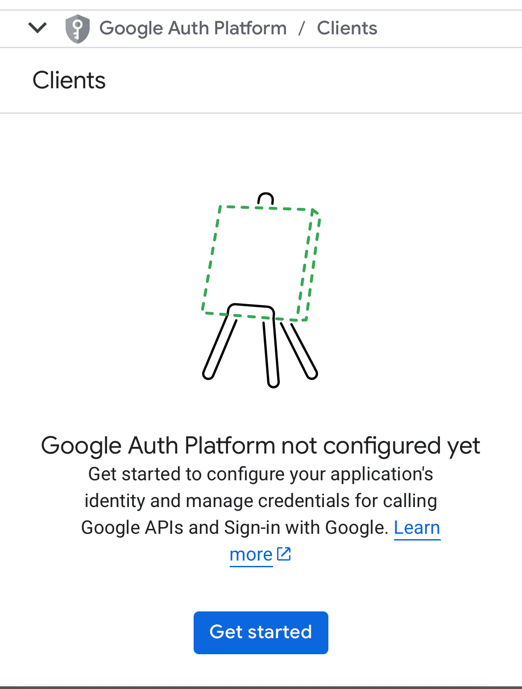
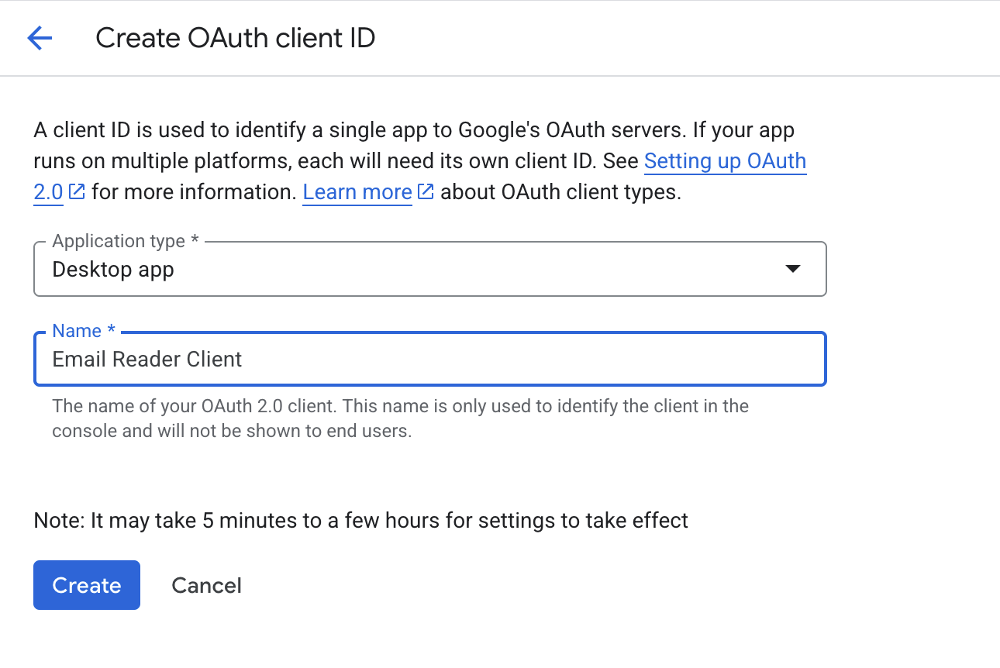
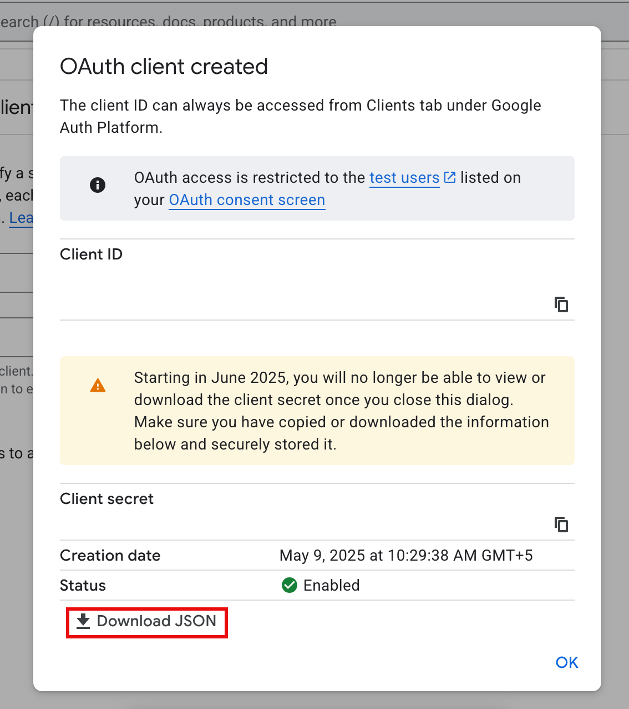
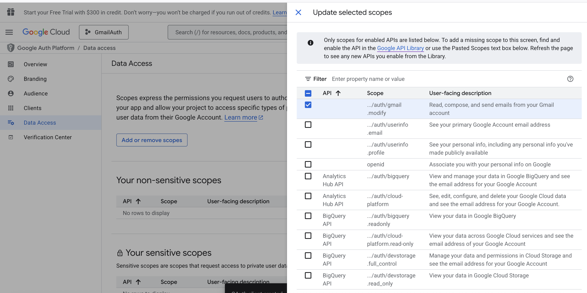
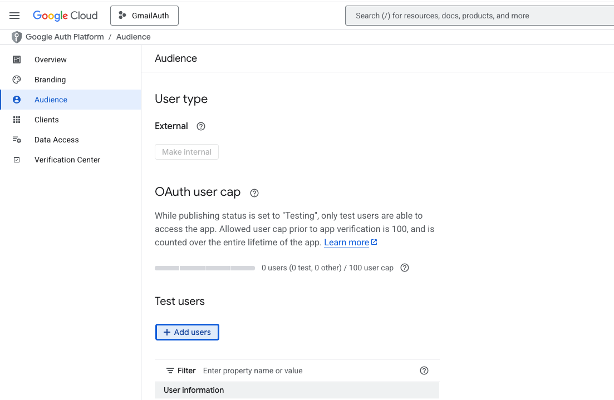

# Google Rest API Setup

### Create An Project in GCP
https://console.cloud.google.com/projectcreate

### Create Your OAuth Client
1. Head over to [OAuth Client Page](https://console.cloud.google.com/auth/clients)
2. If You haven't configured Any Oauth Clients before, You will see the following screen, Click on Get Started button
<div align="center">  </div>

3. Click on Create 
<div align="center">  </div>
   
4. Select Application Type as Desktop App and Name Your File as Email Reader
5. Click Ok
6. In The Popup that appears Click on Download JSON to download the secrets file, Rename the file as credentials.json and store it in your computer
<div align="center">  </div>


### Enable the Gmail API for Your Google Cloud Application
1. Head over to the [gmail api page](https://console.cloud.google.com/marketplace/product/google/gmail.googleapis.com) and click enable
2. Come back to your [gcp console](https://console.cloud.google.com/auth/scopes)
3. Click on Data Access Tab
4. Click Add Or Remove Scopes Button
5. In Filter Type Gmail API and Select the /auth/gmail.modify Permission
6. Scroll Down to Restricted Scopes Section and Click on Save   
<div align="center">  </div>


### Add Test User
1. Click on Audience
2. Scroll Down and go to the Test Users Section
3. Click on Add Users
4. Enter Your Email ID and Click Save
<div align="center">  </div>


# Setting Up The Project

### Supported Python Versions
3.10 and Above

### Install Required Dependencies
```
pip install .
```

# Using the Functionalities
### Loading Emails
You can load emails from gmail by running the following command
```bash
load-emails -c /path/to/credentials-file/credentails.json
```
Credentials file is the file which you downloaded during GCP Client Creation (Create Your OAuth Client - Step 5)


### Manage Emails
### Defining Your Rules File

You can apply the rules file and manage emails using the following command
Read more on how to define the rules file [Here](Rules.md)

You can also have a look at the sample rules file defined at tests/static folder

To Use the functionality

```bash
manage-emails -c /path/to/credentials-file/credentails.json -r /path/to/rules-file.json
```


# Running Test Cases
### Install Dependencies Required
```bash
pip install email-reader\[dev\]
```

### Run Test Cases
```bash
pytest -v
```
